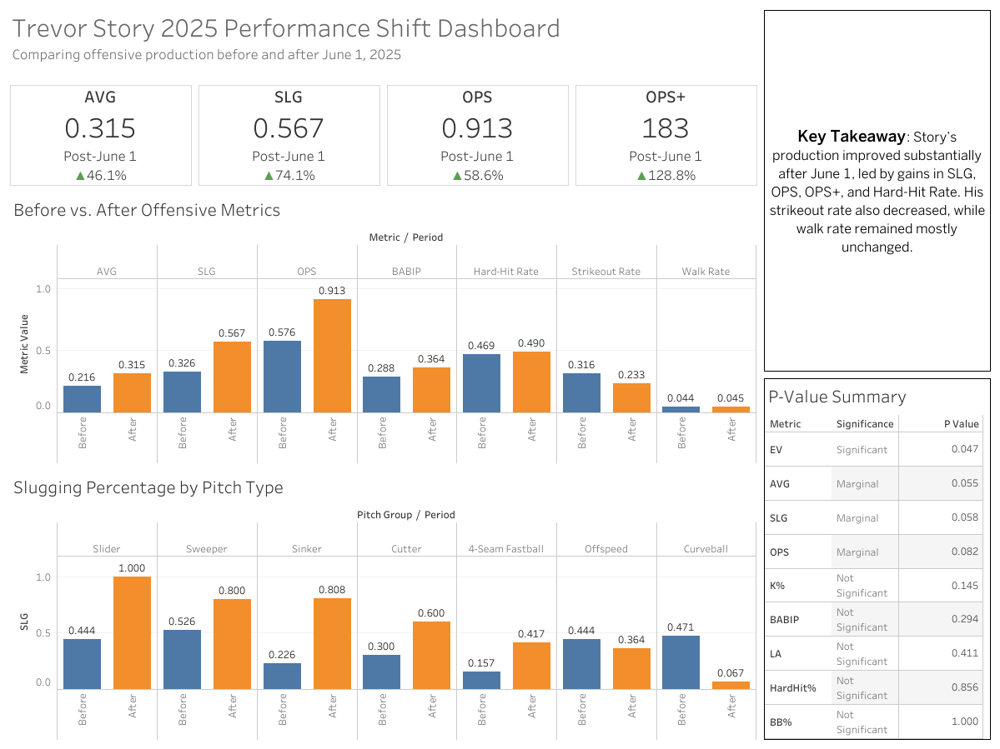

# Trevor Story 2025 Performance Shift Analysis

## Overview

This project analyzes Trevor Story’s offensive performance during the 2025 MLB season, comparing his production before and after June 1, 2025. The analysis uses Statcast data collected in R and visualized through an interactive Tableau Public dashboard.

The goal of the project was to determine whether Story’s post-June 1 improvement was supported by changes in key offensive metrics, batted-ball quality, pitch-type performance, and statistical evidence.

## Dashboard

View the interactive Tableau dashboard here:

[Tableau Public Dashboard](https://public.tableau.com/views/TrevorStory2025PerformanceShiftDashboard/PerformanceShiftDashboard?:language=en-US&:sid=&:redirect=auth&:display_count=n&:origin=viz_share_link)



## Research Question

Did Trevor Story’s offensive performance meaningfully improve after June 1, 2025, and which metrics or pitch types showed the largest changes?

## Tools Used

* R
* baseballr
* dplyr
* tidyr
* ggplot2
* Tableau Public
* Statistical testing

## Data

Statcast data was collected using the `baseballr` package for games from March 27, 2025 through July 15, 2025. The data was split into two periods:

* **Before June 1, 2025**
* **After June 1, 2025**

The cleaned datasets were then exported for Tableau visualization.

## Metrics Analyzed

The analysis compared several offensive and batted-ball metrics, including:

* Batting Average
* Slugging Percentage
* On-Base Plus Slugging
* OPS+
* BABIP
* Hard-Hit Rate
* Strikeout Rate
* Walk Rate
* Average Exit Velocity
* Average Launch Angle
* Slugging Percentage by Pitch Type

## Methods

The project included:

* Pulling Statcast data using `baseballr`
* Cleaning and transforming pitch-level data in R
* Creating before/after performance summaries
* Calculating offensive metrics manually from event-level data
* Grouping pitch types into broader pitch categories
* Running statistical tests to compare pre- and post-June 1 performance
* Building an interactive Tableau dashboard to communicate findings

## Key Findings

* Batting average increased from .216 before June 1 to .315 after June 1.
* Slugging percentage increased from .326 to .567.
* OPS increased from .576 to .913.
* OPS+ increased from 80 to 183.
* Strikeout rate decreased from 31.6% to 23.3%.
* Walk rate remained mostly unchanged.
* Exit velocity showed statistically significant evidence of improvement.
* AVG, SLG, and OPS showed marginal evidence of improvement.
* Pitch-type results suggested improved slugging against several pitch groups, though these results should be interpreted cautiously due to smaller sample sizes.

## Limitations

* Pitch-type results may be noisy because sample sizes vary by pitch group.
* OPS+ was calculated using a simplified formula and does not include full park adjustments.
* The June 1 split was selected for exploratory comparison and should not be interpreted as evidence of causation.
* Some statistical comparisons are limited by sample size and game-level variability.

## Project Structure

```text
Trevor-Story-Analysis/
│
├── README.md
├── scripts/
│   └── Trevor_Story_Analysis.R
├── report/
│   └── Trevor_Story_Analysis_Report.pdf
├── dashboard/
│   └── tableau_public_link.txt
├── images/
│   └── trevor_story_dashboard.png
└── data/
    ├── story_totals.csv
    ├── story_metrics_long.csv
    ├── story_pitch_stats.csv
    └── story_significance_tests.csv
```

## Business / Baseball Implications

This project demonstrates how player performance data can be translated into an accessible dashboard for evaluating changes in offensive production. A similar workflow could support front-office analysis, player development, coaching decisions, or sports media storytelling by combining statistical analysis with clear visual communication.
